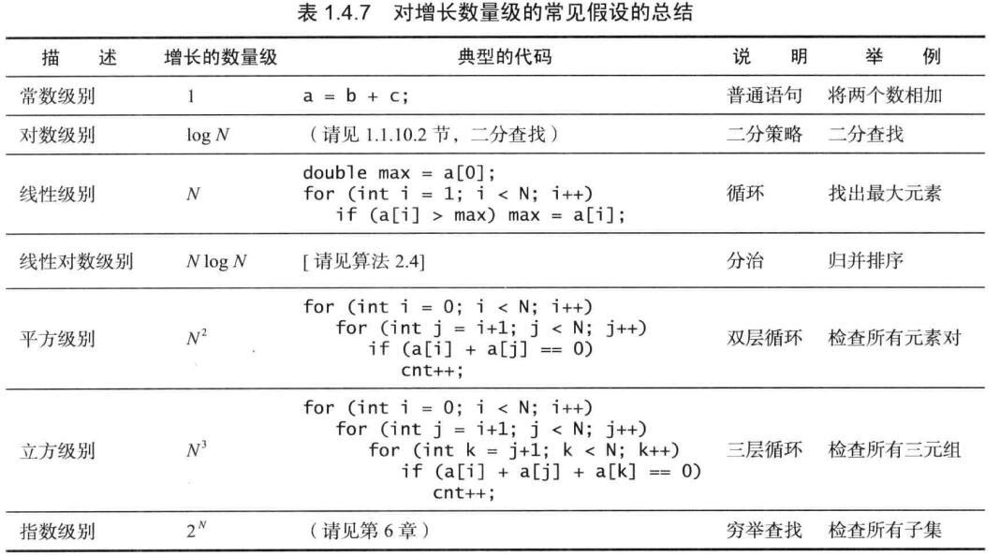
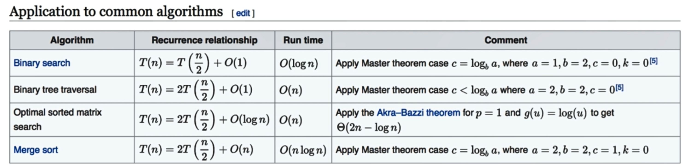
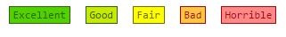
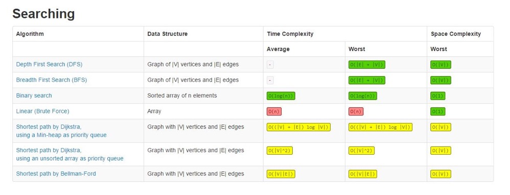
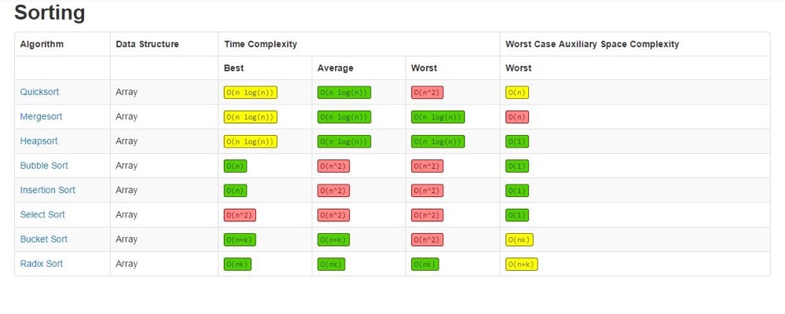
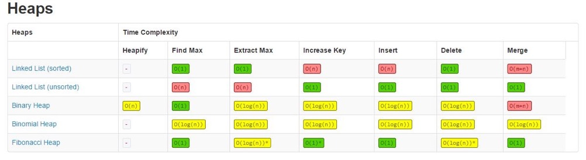
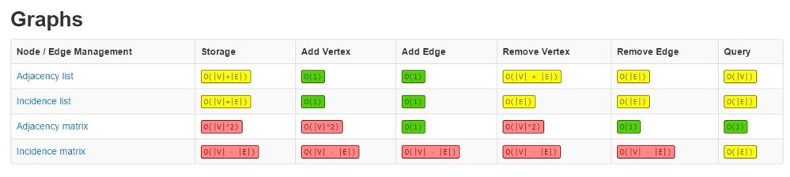

# Conch-LeetCode
##### LeetCode Algorithm

##### 数据结构

- Array
- Stack
- LinkedList
- Queue/PriorityQueue(heap)
- Set/Disjoint Set
- Map/HashTable
- Tree/Binary Search Tree/Spanning tree
- Trie 字母树
- BloomFilter
- LRU Cache

##### 算法

- Sorting 排序算法
- Graph 图
- Hashing 哈希
- Greedy 贪婪算法
- Resursion/Backtrace  递归/回溯
- Traversal  遍历   前中后序(In-Order/Pre-Order/Post-Order)
- Breadth-first/Depth-first search  广度优先、深度优先
- Divide and Conquer  分而治之
- Dynamic Programming 动态规划
- Binary Search 二分法查询
- Graph 图

​    

##### 解题思路

- 明确题意 Clarification
- 可能解 Possible Solutions
  - comare(time/space) 最优解
  - optimal 
- Coding 多写
- Test cases

##### 复杂度

- 时间
- 空间

 

​    

##### Big O notation

- O(1) 常数复杂度
- O(logn) 对数复杂度： 二分查找法
  - 平衡二叉树
- O(n) 线性复杂度 ：二叉树遍历（每个节点只遍历一次）   ，排序(Optimal sorted matrix search)
- o(nlogn) 线性对数复杂度：快排，归并排序
-  O(n^2) 平方 ： 斐波那契
- O(n^3) 立方
- O(2^n) 指数
- O(n!) 阶乘

##### Master Theorem (主定理)

